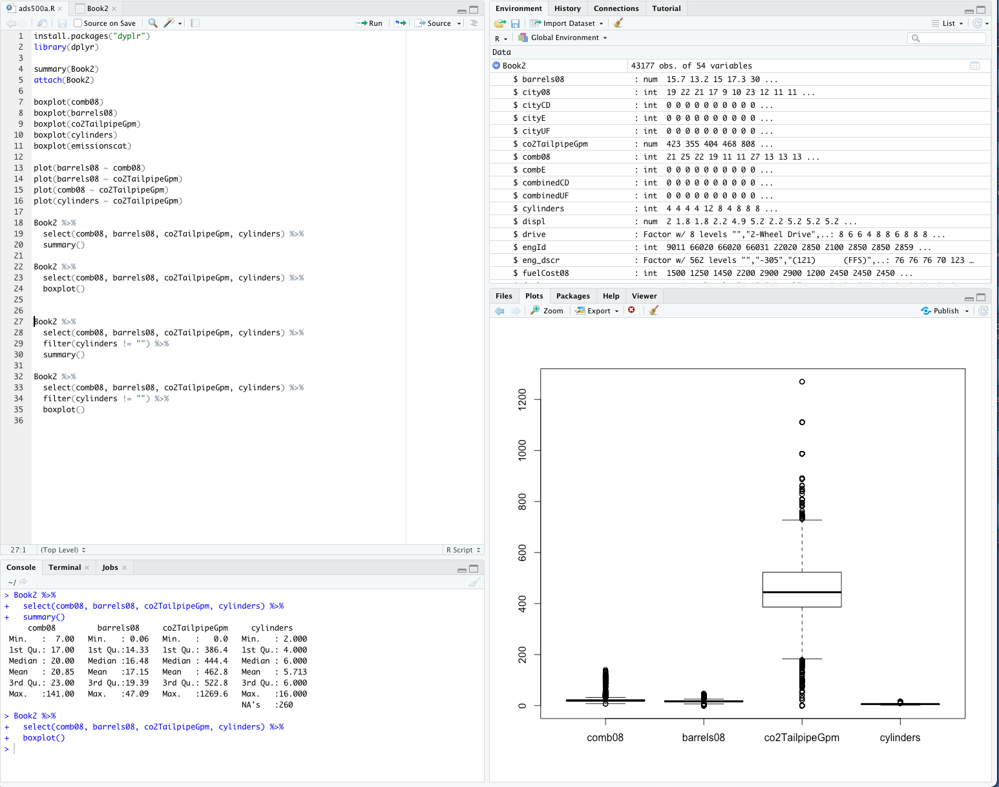
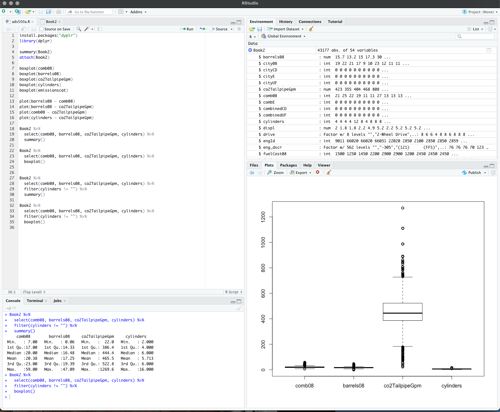

# Files in this folder

## Book2.csv

This is the workfile tab, from the data provided in class, exported in to csv. Turns out, this is not necessary for RStudio can import from Excell.

## ads500a.R
This is my experimental R script, once I have something I want to save I copy it to another file name, for example: ads500a01.R.

## ads500a01.R
In this file I do some very basic exploratory analysis and boxplots. In the first instance I take all the data. In the second instance I filter IN the data that where cylinders are not empty, this is to filter out pure electric vehicles and keep hybrids. 

### Including cylinders == ""
{ width=50% }

### Excluding cylinders == ""

--- 
# R tutorials
- [R Programming Tutorial - Learn the Basics of Statistical Computing](https://youtu.be/_V8eKsto3Ug)
- [Excersice files for the tutorial](https://drive.google.com/drive/folders/15U8WjVKbYXaq6N6Wb_6bCr9QZ1DwCkAO)
- [Tutorial's home page](https://datalab.cc/tools/r01)
- [R programming for beginners – statistic with R (t-test and linear regression) and dplyr and ggplot](https://youtu.be/ANMuuq502rE)

